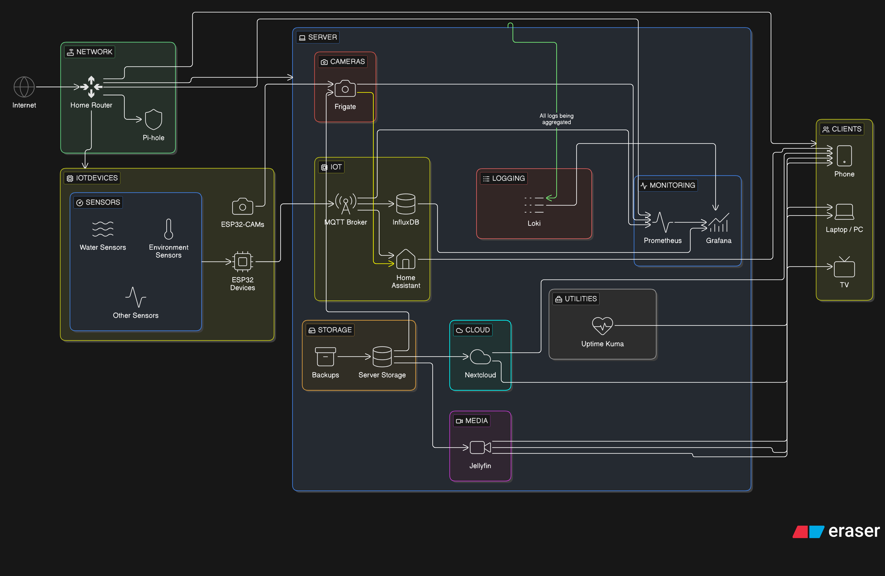

# HL_IoTBasedSmartHome
This is the `v2` that I am making for my Home. The main aim of this is that, I can use the Server, along with my Pi  Zero *(the PI Hole for the LAN)*; and along with that, the server will be running things that would be modular- so, user can customize what all he wants to have on the server *(and if, in future reqs change, can add on more things!)*

So, this HL will have the following things *(along with some more, which I will add as I make and refine this)*.
- Telemetry for Containers and Services running on the server.
- Status of Pi Zero and Router
- MQTT Server running to which other IoT devices can connect.
- Jellyfin, NextCloud and Samba for LAN based media access *(along with TailScale)*

## ARCHITECTURE
The following is the architecture of the current server-

