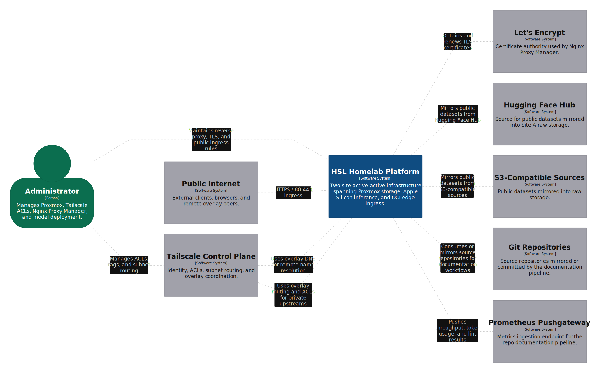
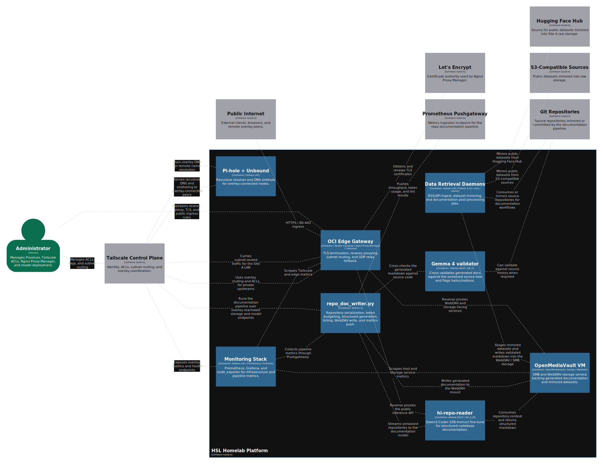
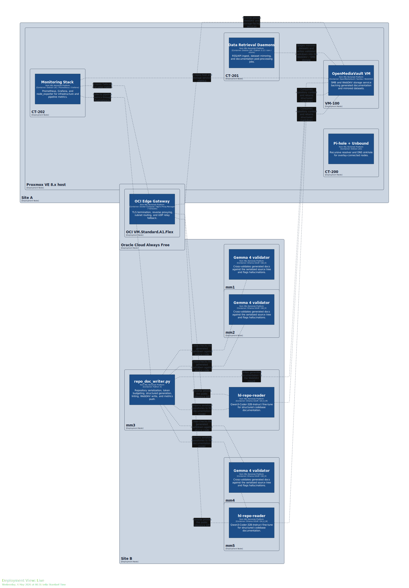

# HL — Geo-Distributed Inference & Storage Topology

A two-site, active-active homelab spanning a Proxmox x86_64 storage appliance (Site A) and a 5-node Apple Silicon compute cluster (Site B), stitched together through an Oracle Cloud free-tier ARM64 reverse proxy acting as the single public-internet ingress point. Inter-site traffic rides a Tailscale overlay routed through WireGuard tunnels, with the OCI node advertising the Site A LAN subnet so remote peers can reach internal storage and service endpoints without exposing them directly. RBAC is enforced at the Tailscale ACL layer, mapping authenticated identities to specific storage volumes on Site A and specific inference API ports on Site B.

---


---

## Architecture Diagrams

Click each SVG to open the full-size version in GitHub.

[](Assets/context.svg)

[](Assets/HSLhomelabplatform.svg)

[](Assets/depolyement.svg)

---

## Table of Contents

1. [Infrastructure Requirements](#1-infrastructure-requirements)
2. [Hardware Inventory](#2-hardware-inventory)
3. [Network Architecture](#3-network-architecture)
4. [Storage Layout](#4-storage-layout)
5. [Overlay Network & RBAC](#5-overlay-network--rbac)
6. [Site A — Proxmox Workloads](#6-site-a--proxmox-workloads)
7. [Site B — Inference Cluster](#7-site-b--inference-cluster)
8. [OCI Edge Gateway](#8-oci-edge-gateway)
9. [Deployment Sequence](#9-deployment-sequence)
10. [Monitoring & Observability](#10-monitoring--observability)
11. [Known Failure Modes & Mitigations](#11-known-failure-modes--mitigations)
12. [Sources](#12-sources)

---

## 1. Infrastructure Requirements

Minimum requirements to replicate this topology:

**Ingress / Edge Node**
- Always-on internet-facing compute with a static or elastic public IPv4 address
- Linux kernel ≥ 5.15 for WireGuard in-tree support
- At least 1 vCPU and 1GB RAM — the OCI always-free A1 tier works fine here

**Site A**
- x86_64 CPU with virtualization extensions (VT-x / AMD-V) enabled in UEFI
- Minimum 6 physical cores and 24GB RAM (non-ECC is fine for this workload profile)
- At least one NVMe device for hypervisor thin-pool and LXC rootfs
- Secondary storage pool on spinning disks or a mixed SSD/HDD tiered arrangement
- Single WAN uplink — static IP preferred, DDNS acceptable

**Site B**
- Multi-node ARM64 SoC cluster with unified memory architecture (Apple Silicon M-series recommended)
- Managed switch with 10GbE inter-node backhaul
- Dual-WAN gateway capable of per-flow ECMP or failover routing
- Sufficient aggregate DRAM for in-memory model weight storage; the M4 Pro unified memory architecture eliminates PCIe bandwidth constraints for inference since GPU and CPU share the same physical DRAM pool

**Overlay / Routing**
- Tailscale account with subnet routing and ACL features enabled (free tier covers this)
- DuckDNS or equivalent for DDNS if static IP is unavailable at either site
- Firewall rules permitting UDP/41641 outbound on all overlay nodes (Tailscale's preferred DERP-bypass port)

---

## 2. Hardware Inventory

### Cloud Edge — OCI VM.Standard.A1.Flex

| Parameter | Value |
|---|---|
| Architecture | ARM64 (Ampere Altra) |
| vCPUs | 2 |
| RAM | 12GB DDR4 |
| OS | Ubuntu 24.04 LTS (Canonical image) |
| Boot Volume | 100GB iSCSI block volume |
| Public IP | Static OCI-assigned elastic IPv4 |
| Cost | Free (OCI Always Free tier) |

The OCI instance runs no compute workloads. Its only jobs are TLS termination via Nginx Proxy Manager, Tailscale subnet advertisement, and UDP relay fallback for overlay peers that cannot establish direct WireGuard paths.

---

### Site A — x86_64 Storage & Automation Appliance

| Parameter | Value |
|---|---|
| CPU | Intel Core i5-8500 (Coffee Lake, 6C/6T, base 3.0 GHz, boost 4.1 GHz) |
| RAM | 24GB DDR4-2666 (2×8GB + 1×8GB — two slots populated on channel A, one on B) |
| Hypervisor | Proxmox VE 8.x (Debian 12 Bookworm base, kernel 6.8 PVE) |
| NVMe (OS/VM thin pool) | 256GB PCIe 3.0 NVMe (LVM-thin, provisioned under `pve` volume group) |
| SSD (tiered storage) | 512GB SATA SSD (SMB hot-tier, Btrfs) |
| HDD 1 (tiered storage) | 1TB SATA HDD (SMB cold-tier, Btrfs RAID1 metadata with SSD) |
| HDD 2 (raw pool) | 2TB SATA HDD (unstructured block, backups and raw dataset staging) |
| NIC | 1GbE onboard Intel I219-V (single WAN uplink) |
| PSU | 65W DC-in barrel (fanless SFF chassis) |

The LVM-thin pool on the NVMe device backs all Proxmox VMs and LXC containers. Thin provisioning allows over-commitment; write amplification is monitored via `lvs -o +data_percent,metadata_percent`. The Btrfs volume spanning the SSD and first HDD uses `btrfs balance` to migrate cold blocks from SSD to HDD on a weekly cron.

---

### Site B — ARM64 Tensor Compute Cluster

| Parameter | Value |
|---|---|
| Nodes | 5× Mac mini (M4 Pro) |
| CPU aggregate | 70 cores (14-core per node: 10 performance + 4 efficiency) |
| GPU aggregate | 100 cores (20-core GPU per node, shared unified memory) |
| NPU aggregate | 80 cores (16-core Apple Neural Engine per node) |
| Unified Memory total | 240GB (48GB per node) |
| NVMe storage total | ~40TB (8TB per node, PCIe 4.0) |
| Inter-node fabric | 10GBASE-T via TP-Link TL-SX1008 unmanaged 10GbE switch |
| SDN controller | TP-Link Omada OC300 hardware controller |
| WAN 1 (primary) | Static IPv4 via ISP business-grade connection — dedicated inference API ingress |
| WAN 2 (failover) | Consumer-grade broadband (automatic failover, no load-balancing on this uplink) |
| OS per node | macOS Sequoia 15.x (Ollama native, Metal compute backend) |

The Omada controller enforces per-SSID VLAN tagging but the Mac mini nodes are all wired. Model weights reside on the local NVMe of each node. The `hl-repo-reader` model (see §7.5) is stored on mm3 and rsync'd to mm5 nightly over the 10GbE backhaul.

---

## 3. Network Architecture

### Physical Topology

```
Public Internet
      │
      ▼
  DuckDNS DDNS  ──── resolves to OCI elastic IPv4
      │
      ▼
 OCI VM (Nginx Proxy Manager)
  - Listens: TCP/80, TCP/443
  - TLS termination via Let's Encrypt (certbot / NPM auto-renewal)
  - Upstream: internal overlay IPs via DDNS reverse-proxy rules
      │
      ▼ (WireGuard-in-Tailscale tunnel, UDP/41641 preferred)
      │
      ├──────────────────────────────────────────────┐
      ▼                                              ▼
 Site A (192.168.1.0/24)                   Site B (192.168.100.0/24)
 Proxmox PVE host                          TP-Link Omada Dual-WAN GW
  └─ OMV VM (SMB/WebDAV)                    └─ 5× Mac mini M4 Pro
  └─ LXC: data retrieval daemons             (Ollama inference cluster)
  └─ LXC: Pi-hole + Unbound
  └─ LXC: Monitoring stack
```

### Overlay Routing Detail

The OCI node is configured as a Tailscale subnet router advertising `192.168.1.0/24` (Site A's LAN). Site B nodes and any remote clients that have their Tailscale ACLs satisfied can reach Site A services directly via routed overlay IPs — no NAT hairpinning. Site B's `192.168.100.0/24` is *not* advertised as a subnet; individual nodes register directly on the Tailscale network and are reachable by their Tailscale-assigned `100.x.y.z` addresses. This avoids routing all Site B inter-node traffic through the OCI node.

**MTU note:** WireGuard inside Tailscale adds ~60 bytes of overhead against a standard 1500-byte WAN MTU, leaving an effective payload MTU of ~1420 bytes on the overlay. Bulk transfers (model weight sync, dataset staging) use `rsync` with `--block-size=1024` to avoid excessive fragmentation on paths where PMTUD isn't reliable.

### DNS Architecture

- **Unbound** runs in a dedicated LXC on Site A as a recursive resolver, resolving from root hints directly with no upstream forwarding.
- **Pi-hole** sits in front of Unbound as a DNS sinkhole. Its upstream resolver is `127.0.0.1#5335` (the Unbound listener port).
- Site B nodes and the OCI gateway point their DNS to Pi-hole's Tailscale IP — all overlay-connected devices share the same sinkholed recursive resolver.
- Internal hostnames for Proxmox VMs, LXC containers, and Site B nodes are registered as local A records in Pi-hole's custom DNS list. No mDNS/Avahi.

---

## 4. Storage Layout

### Site A Physical Devices

```
/dev/nvme0n1     256GB NVMe    → LVM-thin: pve VG
                                  ├── data (thin pool, 200GB)
                                  │     ├── vm-100-disk-0  (OMV VM rootfs, 32GB)
                                  │     ├── vm-101-disk-0  (spare, unallocated)
                                  │     └── subvol-200..N  (LXC rootfs volumes)
                                  └── swap (8GB)

/dev/sda         512GB SSD     → Btrfs (hot-tier)
/dev/sdb         1TB HDD       → Btrfs (cold-tier, RAID1 metadata with sda)
  Combined as a single Btrfs filesystem:
  - Data profile:     single (no redundancy, space-optimized)
  - Metadata profile: RAID1 across sda + sdb
  Exposed via OMV as:
    - SMB share:        \\storage\data  (CIFS, authenticated)
    - WebDAV endpoint:  https://dav.internal/data  (proxied through NPM)

/dev/sdc         2TB HDD       → XFS raw volume
  Mounted at /mnt/raw on the Proxmox host directly.
  Used for: Proxmox backup storage (PBS target), raw dataset staging,
            scratch space for LXC data retrieval jobs.
```

### OMV Virtual Machine Configuration

The OpenMediaVault VM runs as `vm-100` with 4 vCPU cores and 8GB RAM. It receives direct passthrough access to `/dev/sda` and `/dev/sdb` via VirtIO block devices rather than through Proxmox managed storage, so OMV sees the Btrfs filesystem directly and can run `btrfs scrub` and `btrfs balance` without Proxmox intermediating IO. `/dev/sdc` stays on the Proxmox host for backup jobs and is not passed through.

SMB/CIFS is served by Samba 4.x with a local OMV user database — share-level permissions map individual accounts to subdirectories. WebDAV is served by OMV's built-in WebDAV plugin (lighttpd backend). Site B's `hl-repo-reader` model mounts the WebDAV share over the Tailscale overlay and writes synthesized markdown directly to it after each codebase scan.

---

## 5. Overlay Network & RBAC

### Tailscale ACL Structure

ACLs are defined in HuJSON in the Tailscale admin console:

```json
{
  "acls": [
    {
      "action": "accept",
      "src":    ["tag:site-b-compute"],
      "dst":    ["tag:site-a-storage:80"]
    },
    {
      "action": "accept",
      "src":    ["group:tenant-a"],
      "dst":    ["tag:site-a-storage:445", "tag:site-b-compute:11434"]
    },
    {
      "action": "accept",
      "src":    ["group:admins"],
      "dst":    ["*:*"]
    }
  ],
  "tagOwners": {
    "tag:site-a-storage": ["group:admins"],
    "tag:site-b-compute": ["group:admins"]
  }
}
```

Nodes are tagged at registration time via `tailscale up --advertise-tags=tag:site-b-compute`. Tags are immutable once set unless re-authenticated by a tag owner. Identity provider integration uses Tailscale's Google OAuth connector — users authenticate with their Google account and are mapped to groups manually in the ACL file.

### Subnet Router Configuration (OCI)

The OCI node is the only subnet router in this overlay. It advertises Site A's LAN so overlay peers can reach the Proxmox host management UI and internal LXC IPs without requiring Tailscale on every LXC.

```bash
sudo tailscale up \
  --advertise-routes=192.168.1.0/24 \
  --accept-dns=false \
  --hostname=oci-edge-gw
```

`--accept-dns=false` prevents Tailscale from overriding the local `systemd-resolved` config on the OCI node. The advertised route must be approved in the Tailscale admin console before it takes effect.

---

## 6. Site A — Proxmox Workloads

### LXC Container Inventory

All containers are unprivileged (UID/GID mapped), running Debian 12.

| CT ID | Hostname | vCPU | RAM | Purpose |
|---|---|---|---|---|
| 200 | pihole | 1 | 512MB | Pi-hole DNS sinkhole + Unbound recursive resolver |
| 201 | retriever | 2 | 1GB | Data retrieval daemons (Python 3.12, cron-scheduled) |
| 202 | monitor | 2 | 2GB | Prometheus + Grafana + node_exporter stack |
| 203 | nettools | 1 | 256MB | tcpdump, iperf3, mtr — network diagnostics |

### LXC 200 — Pi-hole + Unbound

Pi-hole and Unbound co-locate in a single container to reduce overhead. Unbound listens on `127.0.0.1:5335` and Pi-hole forwards to it. The `100.64.0.0/10` private-address entry in Unbound's config is critical — without it Unbound treats Tailscale CGNAT overlay addresses as invalid and drops them.

```bash
# /etc/unbound/unbound.conf.d/pi-hole.conf (relevant excerpt)
server:
    port: 5335
    interface: 127.0.0.1
    do-ip4: yes
    do-ip6: no
    root-hints: "/var/lib/unbound/root.hints"
    harden-glue: yes
    harden-dnssec-stripped: yes
    edns-buffer-size: 1472
    prefetch: yes
    num-threads: 1
    private-address: 192.168.0.0/16
    private-address: 100.64.0.0/10   # Tailscale CGNAT range
```

### LXC 201 — Data Retrieval Daemons

Runs several Python scripts on cron schedules:

- **RSS/API ingest:** Pulls structured data from public APIs and RSS feeds into `/mnt/raw` (bind-mounted into the LXC read-write).
- **Dataset mirroring:** `rclone sync` jobs pulling public datasets from HuggingFace Hub and S3-compatible sources into the raw XFS volume. Throttled to `--bwlimit 50M` to avoid saturating the Site A WAN uplink during business hours.
- **Doc post-processing:** After `hl-repo-reader` writes synthesized documentation to the WebDAV share, a post-processing script runs a markdown lint pass and commits validated files into a bare Git repository on the SMB volume.

### LXC 202 — Monitoring Stack

Prometheus scrapes `node_exporter` on the Proxmox host (via host network namespace), each Site B Mac mini (launchd service), Tailscale's `/metrics` endpoint on OCI, and Ollama's Prometheus metrics endpoint on Site B (`:11434/metrics`). Grafana runs on port 3000, proxied through NPM on the OCI edge. Retention is 30 days at 15-second scrape intervals; total TSDB size stays under 8GB.

---

## 7. Site B — Inference Cluster

### Node Layout

Nodes are named `mm1` through `mm5`. Each runs Ollama as a native macOS process — Docker on Apple Silicon has significant performance overhead for Metal-accelerated workloads due to GPU passthrough limitations in the container runtime.

```
mm1  192.168.100.11  Tailscale: 100.x.1.1   Primary:  gemma4:27b-instruct-q8_0
mm2  192.168.100.12  Tailscale: 100.x.1.2   Primary:  gemma4:27b-instruct-q8_0
mm3  192.168.100.13  Tailscale: 100.x.1.3   Primary:  hl-repo-reader (Qwen3-Coder-32B fine-tune)
mm4  192.168.100.14  Tailscale: 100.x.1.4   Replica:  gemma4:27b-instruct-q8_0 (failover)
mm5  192.168.100.15  Tailscale: 100.x.1.5   Replica:  hl-repo-reader (failover)
```

### Model Configurations

**Gemma 4 (27B, Q8_0) — mm1, mm2, mm4**

Google released Gemma 4 on April 2, 2026 under Apache 2.0, available in E2B, E4B, 31B, and 26B A4B sizes. The 27B model at Q8_0 quantization loads to ~29GB of unified memory, leaving ~18GB for KV cache and macOS overhead. At a 128K context window, KV cache peaks at roughly 10–12GB — within the 48GB envelope with no swap observed under normal inference load.

```bash
ollama pull gemma4:27b-instruct-q8_0

# Ollama env (set in launchd plist)
# OLLAMA_NUM_PARALLEL=4
# OLLAMA_MAX_LOADED_MODELS=1
# OLLAMA_KEEP_ALIVE=10m
```

**`hl-repo-reader` (Qwen3-Coder-32B fine-tune, Q4_K_M) — mm3, mm5**

A QLoRA fine-tune of Qwen3-Coder-32B-Instruct, trained on-device via Apple MLX to generate structured codebase documentation. Covered in detail in §7.5. At Q4_K_M the model loads to ~20GB, leaving ~28GB for KV cache and macOS overhead. Two concurrent 128K-context codebase scan sessions (~10–12GB KV cache each) fit within the 48GB envelope.

```bash
ollama create hl-repo-reader -f /opt/ollama-models/Modelfile.hl-repo-reader
```

### Inference API Ingress

Site B's primary WAN has a static IPv4. The Omada gateway uses destination NAT rules to forward inbound TCP/11434 to mm1, mm2, or mm3 based on an L4 round-robin policy in the Omada port-forwarding config. Ollama has no built-in multi-node load balancing, so this is handled at the gateway. For authenticated overlay tenants, requests route through Tailscale directly to individual node IPs, bypassing the NAT policy — a tenant ACL can pin a user to mm3 (repo-reader only) and deny mm1/mm2 access at the ACL layer.

---

## 7.5 — `hl-repo-reader`: Fine-Tuned Codebase Documentation Model

`hl-repo-reader` is a QLoRA fine-tune of `Qwen3-Coder-32B-Instruct` — Alibaba's April 2025 Qwen3-Coder release, trained on 36 trillion tokens — adapted specifically for ingesting complete source-code repositories and emitting structured markdown: READMEs, architecture notes, and module-level documentation. The base model was chosen over the Qwen2.5-Coder-32B predecessor for its larger pretraining corpus, hybrid thinking/non-thinking mode (chain-of-thought tokens are suppressed via `enable_thinking=False` to cut latency on bulk documentation runs), and native MCP tool-call support used for `repo_tree` and `file_read` calls during the scan pass.

Expanded training, deployment, and validation notes are documented in [finetune.md](finetune.md).

### Why Fine-Tune

The base Qwen3-Coder-32B instruct model is strong on code generation but inconsistent on structured documentation output without heavy prompt engineering. Observed failure modes on our internal repo corpus before fine-tuning: no awareness of our internal schema (`HSL_DESCRIPTOR` tags, shield badge formatting, ASCII traffic-flow diagrams), hallucinated module interdependencies not present in the actual import graph, inconsistent heading hierarchy across runs on the same repo, and verbose preamble tokens eating into the 128K context budget. A targeted fine-tune on 4,200 (repo, documentation) pairs enforces the output schema at weight level rather than prompt level.

### Fine-Tune Configuration

Training ran entirely on mm1 using Apple's MLX framework (`mlx-lm`) — no cloud dependency. The M4 Pro's unified memory means optimizer state, model weights, and activation gradients share the same physical DRAM pool.

| Parameter | Value |
|---|---|
| Method | QLoRA (4-bit NF4 base weights, BF16 adapters) |
| LoRA rank / alpha | r=64, α=128 |
| Target modules | q/k/v/o proj, gate/up/down proj |
| Training samples | 4,200 (repo, doc) pairs |
| Iterations | 8,000 |
| Learning rate | 2e-5, cosine schedule, 200-step warmup |
| Training node | mm1 (48GB unified memory) |
| Peak memory | ~38GB |
| Duration | ~31 hours, 3 epochs |

```bash
python -m mlx_lm.lora \
  --model qwen3-coder:32b-instruct-q4_K_M \
  --train \
  --data ./training_data/hl-repo-reader/ \
  --iters 8000 \
  --batch-size 2 \
  --lora-layers 32 \
  --lora-rank 64 \
  --lora-alpha 128 \
  --learning-rate 2e-5 \
  --lr-schedule cosine \
  --warmup 200 \
  --grad-checkpoint \
  --adapter-path ./adapters/hl-repo-reader-v2/
```

After training, adapters are fused into the base weights via `mlx_lm.fuse`, re-quantized to Q4_K_M via `llama.cpp`, and registered in Ollama with a custom Modelfile that sets `enable_thinking false`, `num_ctx 131072`, `temperature 0.1`, and a `<|end_of_doc|>` stop token.

### Inference Pipeline

The `repo_doc_writer.py` wrapper on mm3 handles repository serialization, context management, streaming output, schema linting, and WebDAV write:

```
[1] Directory walk + file serialization
        Skips binary files, respects .gitignore, caps individual files at 512KB
        ↓
[2] Token budget check
        < 110K tokens  →  single-pass (full repo in one context window)
        ≥ 110K tokens  →  two-pass hierarchical: per-directory summaries,
                          then synthesis call over summaries
        ↓
[3] Ollama streaming call
        POST http://localhost:11434/api/generate
        model: hl-repo-reader, stream: true, num_ctx: 131072
        ↓
[4] Schema linting
        Validates required section order, HSL_DESCRIPTOR present,
        Known Issues has ≥2 real entries — failures routed to /mnt/raw/failed/
        ↓
[5] Gemma 4 cross-validation (mm1)
        Generated doc + serialized source submitted to gemma4:27b-instruct-q8_0
        Checks factual claims against actual code, returns JSON hallucination report
        Flagged docs held from Git commit pending manual review
        ↓
[6] WebDAV write → CT-201 inotify → markdown lint → Git commit
        /Volumes/webdav-site-a/docs/<repo_name>/README.generated.md
        Committed to bare Git repo at /mnt/smb/repos/docs.git
        ↓
[7] Metrics push to Prometheus Pushgateway
        hl_repo_reader_tokens_per_second, hl_repo_reader_context_used_tokens,
        hl_repo_reader_lint_pass, hl_repo_reader_duration_seconds
```

The two-pass hierarchical fallback handles repositories too large for a single context window. It loses fine-grained implementation detail in the synthesis pass — for those repos, generated docs are flagged in the lint output and routed to manual review.

### Output Schema

All outputs must pass the schema linter before the WebDAV write proceeds:

```
1.  HSL_DESCRIPTOR comment block  (machine-parseable one-liner)
2.  Title (H1)
3.  Shields row
4.  Short prose description       (≤150 words, no bullet points)
5.  ## Architecture               (ASCII traffic-flow diagram required)
6.  ## Components                 (name / type / purpose table)
7.  ## Configuration              (env vars, config file paths)
8.  ## Deployment                 (sequential numbered steps)
9.  ## Known Issues               (≥2 real entries, not placeholder text)
10. ## Sources
```

### Measured Results (80-repo held-out test set)

| Metric | Qwen3-Coder-32B Base | `hl-repo-reader` v2 |
|---|---|---|
| Schema compliance | 34% | 96% |
| HSL_DESCRIPTOR present | 11% | 99% |
| Hallucinated import paths | 18% of docs | 2% of docs |
| Avg. output tokens | 3,200 | 1,850 |
| Markdown lint pass rate | 61% | 94% |

The reduction in average output tokens (3,200 → 1,850) puts per-run latency at ~34s versus ~58s for the base model at mm3's ~55 tokens/sec throughput. Over hundreds of repos processed weekly, this compounds.

### Version History

| Version | Base model | LoRA rank | Samples | Notes |
|---|---|---|---|---|
| v1.0 | Qwen2.5-Coder-32B-Instruct | r=32 | 1,400 | Initial fine-tune, limited schema enforcement |
| v1.5 | Qwen2.5-Coder-32B-Instruct | r=32 | 2,800 | Added adversarial pairs, improved hallucination rate |
| v2.0 | Qwen3-Coder-32B-Instruct | r=64 | 4,200 | New base model, doubled LoRA rank, full schema enforcement |

Adapter transfer from v1.5 (Qwen2.5-Coder) to Qwen3-Coder was attempted and produced 72% schema compliance versus 96% for a clean retrain, likely due to tokenizer differences between model generations. A fresh retrain was faster to produce than debugging the transfer.

---

## 8. OCI Edge Gateway

### Nginx Proxy Manager

NPM is deployed via Docker Compose on the OCI instance:

```yaml
services:
  npm:
    image: jc21/nginx-proxy-manager:latest
    ports:
      - "80:80"
      - "443:443"
      - "81:81"   # NPM admin UI — firewall to Tailscale IP only
    volumes:
      - ./data:/data
      - ./letsencrypt:/etc/letsencrypt
    restart: unless-stopped
```

| Public hostname | Upstream | Notes |
|---|---|---|
| `grafana.yourdomain.com` | `100.x.x.x:3000` | Grafana on CT-202, via Tailscale IP |
| `dav.yourdomain.com` | `192.168.1.x:80` | OMV WebDAV, routed via subnet |
| `api.yourdomain.com` | `192.168.100.11:11434` | Ollama on mm1 (Gemma 4 primary) |
| `*.yourdomain.com` | — | Wildcard cert via Let's Encrypt DNS challenge |

The NPM admin UI on port 81 is blocked from the OCI public interface via Security List. Access requires connecting through Tailscale first.

### OCI Security List

```
TCP  0.0.0.0/0   → 80     ALLOW  (HTTP, Let's Encrypt ACME)
TCP  0.0.0.0/0   → 443    ALLOW  (HTTPS)
UDP  0.0.0.0/0   → 41641  ALLOW  (Tailscale direct WireGuard)
TCP  <admin_ip>  → 22     ALLOW  (SSH, restricted to known IP)
ALL  0.0.0.0/0   → *      DENY   (default)
```

SSH uses Ed25519 key authentication only. `PasswordAuthentication no` and `ChallengeResponseAuthentication no` in `/etc/ssh/sshd_config`. Root login disabled.

### IPv4 Forwarding & UFW

```bash
# /etc/sysctl.d/99-tailscale.conf
net.ipv4.ip_forward = 1
net.ipv6.conf.all.forwarding = 0

sudo sysctl --system

# UFW — must explicitly allow Tailscale interface and enable forwarding
sudo sed -i 's/DEFAULT_FORWARD_POLICY="DROP"/DEFAULT_FORWARD_POLICY="ACCEPT"/' /etc/default/ufw
sudo ufw allow in on tailscale0
sudo ufw allow out on tailscale0
sudo ufw reload
```

`DEFAULT_FORWARD_POLICY="ACCEPT"` is required — without it, UFW's default chains silently drop all forwarded packets regardless of per-interface rules.

---

## 9. Deployment Sequence

Tailscale must be fully peered before site-specific services that depend on overlay IPs are started.

### Step 1 — OCI Gateway

```bash
curl -fsSL https://tailscale.com/install.sh | sh

sudo tailscale up \
  --advertise-routes=192.168.1.0/24 \
  --accept-dns=false \
  --hostname=oci-edge-gw

# Approve subnet route in Tailscale admin console before continuing

echo "net.ipv4.ip_forward=1" | sudo tee /etc/sysctl.d/99-tailscale.conf
sudo sysctl --system

sudo sed -i 's/DEFAULT_FORWARD_POLICY="DROP"/DEFAULT_FORWARD_POLICY="ACCEPT"/' /etc/default/ufw
sudo ufw allow in on tailscale0
sudo ufw allow out on tailscale0
sudo ufw reload

cd /opt/npm && docker compose up -d
```

### Step 2 — Site A (Proxmox Host)

```bash
curl -fsSL https://tailscale.com/install.sh | sh

sudo tailscale up \
  --accept-routes \
  --accept-dns=true \
  --hostname=site-a-pve

# Verify overlay connectivity before starting VMs/LXCs
ping 100.x.x.x   # OCI Tailscale IP
```

LXC containers do not run Tailscale individually — the Proxmox host routes overlay traffic to the `lxcbr0` bridge:

```bash
iptables -A FORWARD -i tailscale0 -o lxcbr0 -j ACCEPT
iptables -A FORWARD -i lxcbr0 -o tailscale0 -m state --state RELATED,ESTABLISHED -j ACCEPT
# Persist via /etc/network/interfaces post-up rules or pve-firewall config
```

### Step 3 — Site B (Each Mac mini)

```bash
brew install tailscale
sudo tailscale up \
  --accept-routes \
  --accept-dns=true \
  --advertise-tags=tag:site-b-compute \
  --hostname=mm1   # adjust per node

brew services start ollama

# mm1, mm2, mm4:
ollama pull gemma4:27b-instruct-q8_0

# mm3, mm5:
ollama create hl-repo-reader -f /opt/ollama-models/Modelfile.hl-repo-reader

# Verify
curl http://localhost:11434/api/generate \
  -d '{"model":"gemma4:27b-instruct-q8_0","prompt":"ping","stream":false}'
```

---

## 10. Monitoring & Observability

### Prometheus Scrape Targets

```yaml
scrape_configs:
  - job_name: 'proxmox-host'
    static_configs:
      - targets: ['192.168.1.10:9100']

  - job_name: 'site-b-nodes'
    static_configs:
      - targets:
          - '100.x.1.1:9100'   # mm1
          - '100.x.1.2:9100'   # mm2
          - '100.x.1.3:9100'   # mm3
          - '100.x.1.4:9100'   # mm4
          - '100.x.1.5:9100'   # mm5

  - job_name: 'ollama'
    metrics_path: '/metrics'
    static_configs:
      - targets:
          - '100.x.1.1:11434'
          - '100.x.1.3:11434'

  - job_name: 'tailscale-oci'
    static_configs:
      - targets: ['100.x.x.x:9100']
```

### Key Grafana Panels

- **Site B unified memory pressure** — `node_memory_MemAvailable_bytes` per node, alerting below 8GB available (KV cache eviction risk)
- **Ollama inference throughput** — tokens/sec per model per node, sourced from Ollama's Prometheus metrics
- **`hl-repo-reader` pipeline** — `hl_repo_reader_tokens_per_second`, `hl_repo_reader_context_used_tokens`, `hl_repo_reader_lint_pass` pushed from `repo_doc_writer.py` to Pushgateway
- **WAN failover events** — Omada syslog forwarded to Prometheus Pushgateway; gauge set to 0 on failover activation
- **LXC disk IO on thin pool** — `node_disk_io_time_seconds_total` on `/dev/dm-*` devices; useful for catching thin pool metadata exhaustion before it causes VM/LXC IO stalls
- **Tailscale peer latency** — custom script on the Proxmox host runs `tailscale ping --c 3 <peer>` every 60 seconds and pushes RTT to Pushgateway

---

## 11. Known issues cause yeah

**LVM-thin pool metadata exhaustion**
If the thin pool metadata device fills before the data device, all IO on VMs and LXCs stalls until the metadata device is expanded. Monitor `metadata_percent` via `lvs` and alert above 70%. Pre-allocate more metadata than Proxmox's default: `lvcreate --type thin-pool -L 200G --poolmetadatasize 4G pve/data`.

**Ollama model swap on memory pressure**
macOS will swap Ollama model weights to NVMe under memory pressure if background processes (Spotlight, iCloud sync) consume concurrent RAM. Mitigate by disabling Spotlight indexing on the data volume and setting `OLLAMA_MAX_LOADED_MODELS=1` to prevent Ollama from holding multiple model weight sets in memory simultaneously.

**Tailscale DERP relay fallback latency**
If a direct WireGuard path cannot be established between sites (ISP blocking UDP/41641), Tailscale falls back to DERP relay, adding 20–80ms RTT. Tolerable for WebDAV doc writes; material impact on bulk dataset transfers. Ensure UDP/41641 is explicitly permitted outbound at both ISPs and verify with `tailscale ping --peerapi <node>`.

**OCI free tier egress cap**
OCI's always-free tier includes 10TB outbound per month. Current workloads (Grafana access, WebDAV writes, remote SMB) stay under 50GB/month. Exposing the Ollama API endpoint publicly via NPM can generate significant egress from streaming LLM responses — monitor OCI's egress counter and rate-limit the Nginx upstream if needed.

**Pi-hole as single point of failure for overlay DNS**
All overlay nodes use Pi-hole as their DNS resolver. If CT-200 crashes, overlay DNS resolution fails across all sites. Mitigation: set `onboot: 1` on CT-200 in Proxmox and configure a fallback resolver of `1.1.1.1` in each node's Tailscale DNS config — Tailscale only uses the fallback when the primary is unreachable.

**`hl-repo-reader` KV cache overflow on large monorepos**
Repositories serialized above 128K tokens exceed the model's native context window. The two-pass hierarchical fallback in `repo_doc_writer.py` handles this but loses fine-grained implementation detail in the synthesis pass. Affected repos are flagged in the lint output and routed to manual review rather than direct Git commit.

---

## 12. Sources

- Tailscale Subnet Routing: https://tailscale.com/kb/1019/subnets/
- Tailscale ACL Reference: https://tailscale.com/kb/1337/acl-syntax/
- Proxmox VE Wiki: https://pve.proxmox.com/wiki/Main_Page
- Proxmox LVM-thin Pool Management: https://pve.proxmox.com/wiki/Storage:_LVM_Thin
- Oracle Cloud Free Tier: https://www.oracle.com/cloud/free/
- Ollama Model Library: https://ollama.com/library
- Qwen3-Coder Release: https://github.com/QwenLM/Qwen3-Coder
- Gemma 4 Model Overview: https://ai.google.dev/gemma/docs/core
- Apple MLX Fine-Tuning (mlx-lm): https://github.com/ml-explore/mlx-examples/tree/main/llms
- Unbound DNS: https://nlnetlabs.nl/projects/unbound/about/
- Pi-hole Documentation: https://docs.pi-hole.net/
- Fine-tune notes: [finetune.md](finetune.md)
- Nginx Proxy Manager: https://nginxproxymanager.com/
- TP-Link Omada SDN: https://www.tp-link.com/us/omada-sdi/
- Btrfs Balance & Tiering: https://btrfs.readthedocs.io/en/latest/Balance.html