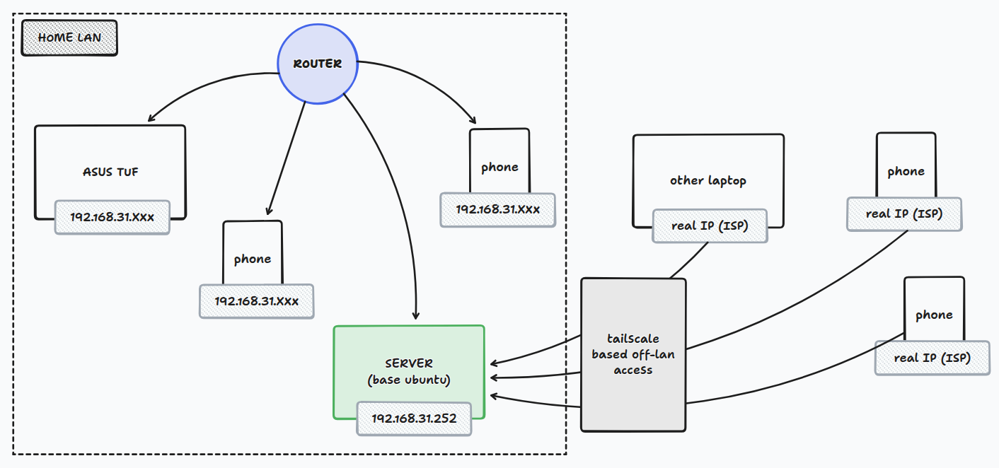

# HS_1 - Tailscale and NextCloud Based
This is the directory/architecture which can be used for a simple home-server which can be switched-on and switched-off; allowing power save along with the HOME CLOUD feature. For the same, the architecture allows for the following things:-

- `LAN SERVER`: Using samba, we can have a JUST LAN BASED storage
- `TAILSCALE + NEXTCLOUD`: Using the homeserver OFF-LAN. This is done via the Tailscale giving VPNized IP connection to access. 

Thus, the following architecture allows to use the architecture as PURE LAN, or, WORK FOR OFF LAN as well; with the flexibility of switching on, or switching off.

--- 

## HOME SERVER SPECS
| SERVICE        | DESCRIPTION        |
|----------------|--------------------|
| Laptop         | HP Laptop          |
| Microprocessor | i3-5th Gen         |
| Wi-Fi          | Phone's Hotspot    |
| Battery        | Only when charging |
| RAM            | 8GB                |
| Storage        | 1TB Hard Disk      |

---

## ARCHITECTURE
The following is the home-server architecture, how it works. Do check the below shcematic out:

---

## INSTRUCTIONS (SETTING UP)

